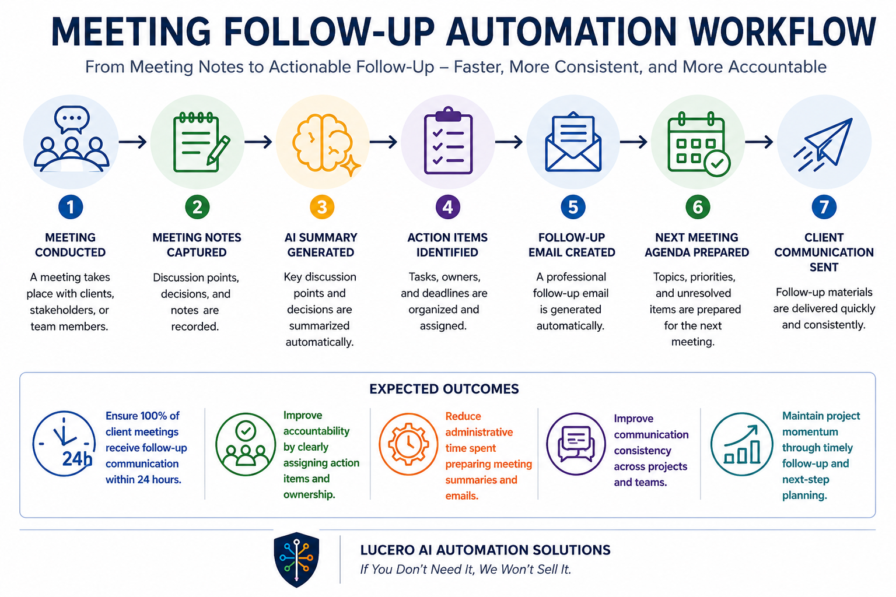

## Outcome

Ensure 100% of client meetings receive follow-up communication within 24 hours while improving accountability, clarity, and project momentum.

---

## Overview

This project demonstrates how organizations can automate post-meeting follow-up by transforming meeting notes into structured summaries, action items, follow-up emails, and next meeting agendas.

The workflow is designed to reduce post-meeting administrative work and improve communication consistency.

---

## Business Challenge

Many organizations struggle with inconsistent meeting follow-up. Staff may spend time manually:

- Reviewing meeting notes
- Summarizing discussion points
- Identifying action items
- Drafting follow-up emails
- Preparing next meeting agendas
- Tracking decisions and responsibilities

These manual tasks can lead to delays, missed action items, and unclear communication.

---

## Solution

The Meeting Follow-Up Automation Workflow streamlines post-meeting communication by organizing meeting information and generating structured follow-up materials.

### Workflow

Meeting Conducted

↓

Meeting Notes Captured

↓

AI Summary Generated

↓

Action Items Identified

↓

Follow-Up Email Created

↓

Next Meeting Agenda Prepared

↓

Client Communication Sent

---

## Expected Outcomes

### Faster Follow-Up

Ensure 100% of client meetings receive follow-up communication within 24 hours.

### Improved Accountability

Clearly identify action items, owners, and next steps.

### Better Client Communication

Create consistent, professional follow-up messages after every meeting.

### Reduced Administrative Work

Reduce time spent drafting summaries, emails, and agendas.

### Stronger Project Momentum

Keep projects moving by clarifying priorities and next actions.

---

## Technology Examples

This workflow could be implemented using technologies such as:

- Microsoft Teams
- Zoom
- Google Meet
- Microsoft Word
- Google Docs
- Microsoft Power Automate
- Zapier
- OpenAI
- CRM Platforms

Technology selection depends on organizational requirements and existing systems.

---

## Business Impact

Organizations implementing meeting follow-up automation workflows can:

- Improve follow-up consistency
- Reduce missed action items
- Increase client responsiveness
- Improve accountability
- Reduce post-meeting administrative workload
- Improve project communication

---

## Who This Helps

- Consulting Firms
- Professional Services Firms
- Nonprofit Organizations
- Churches
- Educational Programs
- Real Estate Professionals
- Small Businesses

---

## Consulting Approach

Lucero AI Automation Solutions follows a trust-based approach:

> If You Don't Need It, We Won't Sell It.

The objective is to identify the simplest solution that delivers measurable business results without unnecessary software, subscriptions, or complexity.

---

## Project Status

Portfolio Demonstration Project

This project demonstrates a practical meeting follow-up automation workflow and is intended as an example of how post-meeting communication can be redesigned to improve efficiency, consistency, and accountability.
